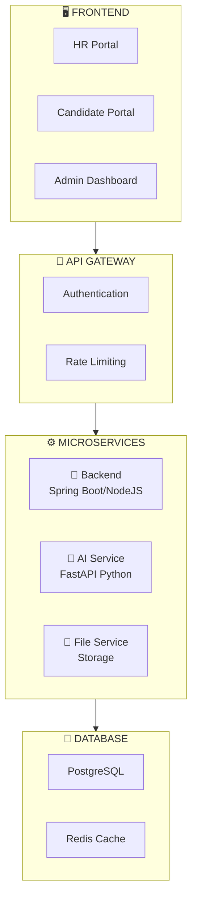
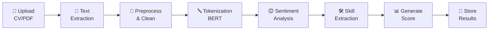
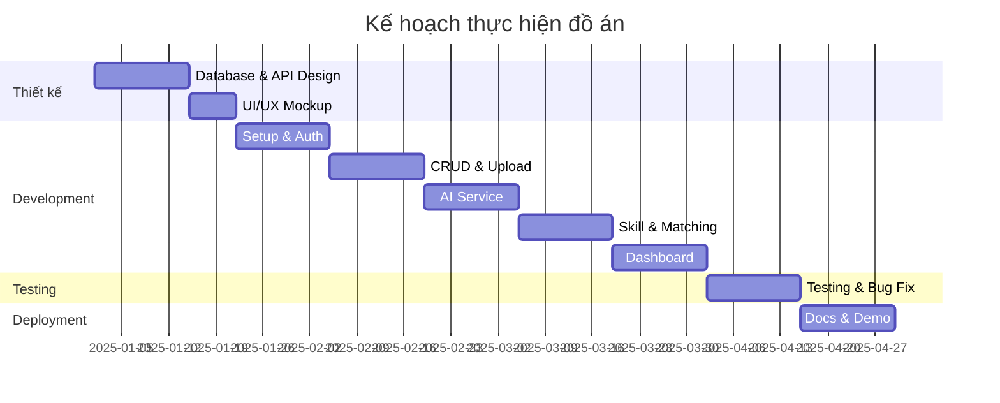

<p align="center">
  <h1 align="center">🎯 ĐỒ ÁN CHUYÊN NGÀNH 3 – IT</h1>
  <h2 align="center">ỨNG DỤNG AI PHÂN TÍCH CẢM XÚC TRONG HỆ THỐNG TUYỂN DỤNG</h2>
  <p align="center">
    
    
    
  </p>
</p>

---

## 📋 Mục lục

- [Giới thiệu](#-giới-thiệu)
- [Phân tích đề tài](#-phân-tích-và-đánh-giá-đề-tài)
- [Vấn đề cần chỉnh sửa](#️-vấn-đề-cần-chỉnh-sửa)
- [Đề xuất bổ sung](#-đề-xuất-bổ-sung)
- [Kiến trúc hệ thống](#-kiến-trúc-hệ-thống-đề-xuất)
- [Pipeline AI](#-pipeline-xử-lý-ai-đề-xuất)
- [Cấu trúc thư mục](#-cấu-trúc-thư-mục-đề-xuất)
- [Kế hoạch thực hiện](#-kế-hoạch-thực-hiện-đề-xuất)
- [Dataset](#-dataset-tiếng-anh-đề-xuất)
- [Tech Stack](#-công-nghệ-stack-cuối-cùng)
- [Checklist](#-checklist-hoàn-thành)
- [Kết luận](#-kết-luận)

---

## 🎯 Giới thiệu

Hệ thống tuyển dụng trực tuyến tích hợp AI để phân tích cảm xúc và đánh giá mức độ phù hợp của ứng viên thông qua CV/Cover Letter.

### Mục tiêu chính
- 🤖 Ứng dụng **Sentiment Analysis** đánh giá thái độ, cảm xúc trong hồ sơ
- 📊 Dashboard trực quan hỗ trợ HR ra quyết định
- 🎯 AI đóng vai trò **hỗ trợ**, không thay thế con người

---

## 📋 PHÂN TÍCH VÀ ĐÁNH GIÁ ĐỀ TÀI

### ✅ ĐIỂM MẠNH CỦA ĐỀ TÀI

| STT | Điểm mạnh | Đánh giá |
|:---:|-----------|----------|
| 1 | **Tính thực tiễn cao** | Giải quyết vấn đề thực tế trong tuyển dụng |
| 2 | **Kết hợp nhiều công nghệ** | Full-stack + AI/NLP + Database |
| 3 | **Kiến trúc Microservices** | Tách biệt Frontend, Backend, AI Service |
| 4 | **Đa đối tượng người dùng** | HR, Ứng viên, Admin - đa dạng use case |
| 5 | **AI hỗ trợ, không thay thế** | Quan điểm đúng đắn về vai trò AI |

---

## ⚠️ VẤN ĐỀ CẦN CHỈNH SỬA

### 1. Dataset - THAY ĐỔI QUAN TRỌNG

> ⚡ **Lưu ý:** Sử dụng **dataset tiếng Anh** thay vì tiếng Việt

**Cần cập nhật lại phần 5 & 6:**

| Mục cũ | Cập nhật mới |
|--------|--------------|
| VLSP, UIT-VSFC (tiếng Việt) | IMDB, SST-2, Yelp Reviews (tiếng Anh) |
| PhoBERT | **BERT, RoBERTa, DistilBERT** |
| NLP tiếng Việt | NLP tiếng Anh |

**Dataset tiếng Anh đề xuất:**
- **Sentiment Analysis:** IMDB, SST-2, Amazon Reviews, Yelp
- **Resume/CV:** Kaggle Resume Dataset, Indeed Resume Dataset
- **Job Description:** Kaggle Job Postings Dataset

### 2. Phạm vi đề tài - Cần điều chỉnh

```diff
- Phân tích văn bản tiếng Việt
+ Phân tích văn bản tiếng Anh (có thể mở rộng tiếng Việt)
```

### 3. Mô hình AI - Cập nhật cho tiếng Anh

```
Đề xuất mô hình:
├── BERT-base-uncased (cơ bản, hiệu quả)
├── RoBERTa (hiệu suất cao hơn)
├── DistilBERT (nhẹ, nhanh, phù hợp deploy)
└── GPT API (OpenAI) - cho tính năng nâng cao
```

---

## 🔧 ĐỀ XUẤT BỔ SUNG

### 1. Bổ sung tính năng

| Tính năng | Mô tả | Độ ưu tiên |
|-----------|-------|:----------:|
| **Email Notification** | Thông báo kết quả cho ứng viên | 🔴 Cao |
| **Export Report (PDF)** | Xuất báo cáo phân tích | 🔴 Cao |
| **Comparison View** | So sánh nhiều ứng viên | 🟡 Trung bình |
| **Interview Scheduler** | Lên lịch phỏng vấn | 🟢 Thấp |
| **Keyword Highlighting** | Highlight từ khóa quan trọng trong CV | 🟡 Trung bình |

### 2. Bổ sung tiêu chí phân tích

```
Sentiment Analysis mở rộng:
├── Confidence Score (độ tin cậy của kết quả)
├── Aspect-based Sentiment (cảm xúc theo khía cạnh)
│   ├── Thái độ với công việc trước
│   ├── Động lực nghề nghiệp
│   └── Kỳ vọng với công ty
├── Professional Tone Score (điểm chuyên nghiệp)
└── Keyword Density (mật độ từ khóa kỹ năng)
```

### 3. Bổ sung công nghệ

| Công nghệ | Mục đích |
|-----------|----------|
| **Redis** | Cache kết quả phân tích |
| **Elasticsearch** | Tìm kiếm nâng cao trong CV |
| **WebSocket** | Real-time notification |
| **MinIO/S3** | Lưu trữ file CV |

### 4. Bổ sung bảo mật

- [ ] Rate Limiting API
- [ ] Input Validation & Sanitization
- [ ] File Upload Validation (size, type, malware scan)
- [ ] GDPR Compliance (cho dữ liệu cá nhân)
- [ ] Audit Logging

---

## 📐 KIẾN TRÚC HỆ THỐNG ĐỀ XUẤT



**Mô tả kiến trúc:**

| Layer | Component | Công nghệ |
|-------|-----------|-----------|
| **Frontend** | HR Portal, Candidate Portal, Admin | ReactJS + ChartJS |
| **Gateway** | Authentication, Rate Limiting | JWT, Nginx |
| **Backend** | REST API, Business Logic | Spring Boot / NodeJS |
| **AI Service** | Sentiment Analysis, NLP | FastAPI, BERT |
| **File Service** | CV Storage | MinIO / S3 |
| **Database** | Data Storage, Caching | PostgreSQL, Redis |

---

## 📊 PIPELINE XỬ LÝ AI ĐỀ XUẤT



### Chi tiết Pipeline

| Bước | Công việc | Công cụ |
|:----:|-----------|---------|
| 1 | Extract text từ PDF/DOCX | PyPDF2, python-docx |
| 2 | Text cleaning | regex, NLTK |
| 3 | Tokenization | Hugging Face Transformers |
| 4 | Sentiment Classification | BERT/RoBERTa |
| 5 | Skill Extraction | NER + Rule-based |
| 6 | Job Matching | Cosine Similarity |
| 7 | Scoring | Weighted Algorithm |

---

## 📁 CẤU TRÚC THƯ MỤC ĐỀ XUẤT

```
DACN3/
│
├── 📂 frontend/                    # ReactJS Application
│   ├── 📂 src/
│   │   ├── 📂 components/
│   │   ├── 📂 pages/
│   │   ├── 📂 services/
│   │   └── 📂 utils/
│   └── 📄 package.json
│
├── 📂 backend/                     # Spring Boot / NodeJS
│   ├── 📂 src/
│   │   ├── 📂 controllers/
│   │   ├── 📂 services/
│   │   ├── 📂 models/
│   │   └── 📂 config/
│   └── 📄 pom.xml / package.json
│
├── 📂 ai-service/                  # Python FastAPI
│   ├── 📂 app/
│   │   ├── 📂 models/
│   │   ├── 📂 services/
│   │   ├── 📂 utils/
│   │   └── 📄 main.py
│   ├── 📄 requirements.txt
│   └── 🐳 Dockerfile
│
├── 📂 database/                    # Database scripts
│   ├── 📂 migrations/
│   └── 📂 seeds/
│
├── 📂 docs/                        # Documentation
│   ├── 📂 api-docs/
│   ├── 📂 diagrams/
│   └── 📂 reports/
│
├── 📂 datasets/                    # Training data
│   ├── 📂 sentiment/
│   ├── 📂 resumes/
│   └── 📂 job_descriptions/
│
├── 🐳 docker-compose.yml
└── 📄 README.md
```

---

## 📅 KẾ HOẠCH THỰC HIỆN ĐỀ XUẤT

| Tuần | Công việc | Output |
|:----:|-----------|--------|
| 1-2 | Thiết kế Database, API, UI mockup | ERD, API docs, Wireframe |
| 3-4 | Setup project, Authentication | Base project + Login |
| 5-6 | CRUD Job, Upload CV | HR & Candidate features |
| 7-8 | AI Service - Sentiment Analysis | Working AI model |
| 9-10 | Skill Extraction & Job Matching | Complete analysis |
| 11-12 | Dashboard & Reporting | Charts, Export PDF |
| 13-14 | Testing & Bug fixing | Test reports |
| 15-16 | Documentation & Demo | Final product |

### Gantt Chart



---

## 📚 DATASET TIẾNG ANH ĐỀ XUẤT

### 1. Sentiment Analysis

| Dataset | Nguồn | Kích thước |
|---------|-------|:----------:|
| IMDB Reviews | Kaggle | 50,000 reviews |
| SST-2 | Stanford | 70,000 sentences |
| Amazon Reviews | Kaggle | 3.6M reviews |
| Yelp Reviews | Kaggle | 6M reviews |

### 2. Resume/CV

| Dataset | Nguồn | Mô tả |
|---------|-------|-------|
| Resume Dataset | Kaggle | 2,400+ resumes with categories |
| Indeed Resume | Kaggle | Real resume data |
| Resume NER | Kaggle | For skill extraction |

### 3. Job Description

| Dataset | Nguồn | Mô tả |
|---------|-------|-------|
| Job Postings | Kaggle | 19,000+ job posts |
| LinkedIn Jobs | Kaggle | Scraped data |
| Indeed Jobs | Kaggle | Job requirements |

---

## ⚡ CÔNG NGHỆ STACK CUỐI CÙNG

<table>
<tr>
<td valign="top" width="33%">

### 🖥️ Frontend


- ReactJS 18+
- Tailwind CSS / Material UI
- ChartJS / Recharts
- Axios
- React Router

</td>
<td valign="top" width="33%">

### ⚙️ Backend


- Spring Boot 3.x / NodeJS
- Spring Security / Passport.js
- JWT Authentication
- JPA / Sequelize

</td>
<td valign="top" width="33%">

### 🤖 AI Service


- Python 3.10+
- FastAPI
- Transformers (Hugging Face)
- BERT / DistilBERT
- PyPDF2, python-docx
- Scikit-learn
- SpaCy (NER)

</td>
</tr>
<tr>
<td valign="top" width="33%">

### 💾 Database


- PostgreSQL
- Redis (Cache)

</td>
<td valign="top" width="33%">

### 🐳 DevOps


- Docker
- Docker Compose
- Nginx (Reverse Proxy)

</td>
<td valign="top" width="33%">

### 🔐 Security


- JWT Authentication
- Password Hashing
- Rate Limiting
- Input Validation

</td>
</tr>
</table>

---

## ✅ CHECKLIST HOÀN THÀNH

### 📋 Phase 1: Design & Setup
- [ ] Database Schema Design
- [ ] API Documentation (Swagger)
- [ ] UI/UX Design (Figma)

### 📋 Phase 2: Core Development
- [ ] Authentication System
- [ ] CV Upload & Storage
- [ ] Text Extraction Service

### 📋 Phase 3: AI Integration
- [ ] Sentiment Analysis Model
- [ ] Skill Extraction Module
- [ ] Job Matching Algorithm
- [ ] Scoring System

### 📋 Phase 4: Dashboard & Reports
- [ ] Dashboard & Charts
- [ ] Export Reports

### 📋 Phase 5: Testing & Deployment
- [ ] Unit Testing
- [ ] Integration Testing
- [ ] Documentation
- [ ] Deployment

---

## 📝 KẾT LUẬN

### Đánh giá tổng thể: ⭐⭐⭐⭐ (4/5)

> **Đề tài tốt, có tính thực tiễn cao.**

### ✅ Checklist quan trọng

| # | Nội dung | Status |
|:-:|----------|:------:|
| 1 | Cập nhật dataset và mô hình cho tiếng Anh | 🔄 |
| 2 | Bổ sung các tính năng nâng cao (export, notification) | 🔄 |
| 3 | Chú ý bảo mật dữ liệu cá nhân | 🔄 |
| 4 | Thiết kế UI/UX thân thiện | 🔄 |
| 5 | Viết documentation đầy đủ | 🔄 |

### ⚠️ Điểm cần cải thiện

- 📌 Làm rõ tiêu chí chấm điểm ứng viên
- 📌 Xác định rõ threshold cho phân loại sentiment
- 📌 Chuẩn bị kế hoạch backup nếu mô hình AI không đạt accuracy mong muốn

---

<p align="center">
  <b>📅 Tài liệu được tạo: 27/12/2025</b><br>
  <b>📌 Version: 1.0</b>
</p>

---

<p align="center">
  Made with ❤️ for DACN3
</p>
